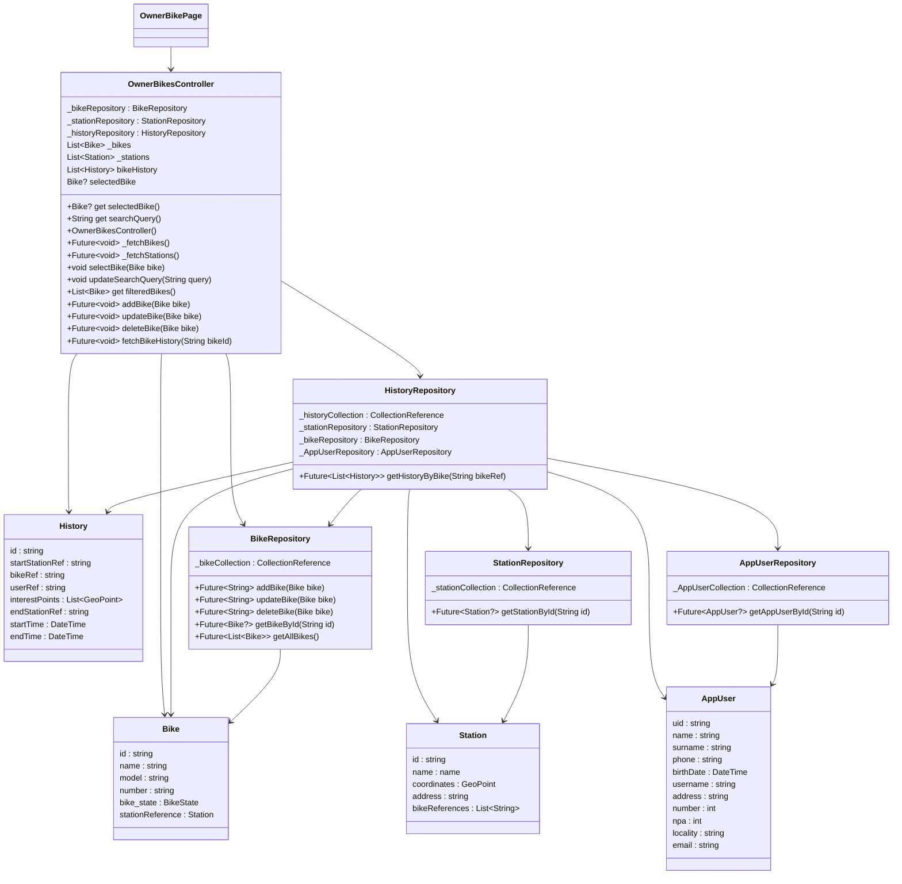

# valais_roll

A bike renting app for the Valais region in Switzerland.
## start the owner app

```bash
flutter run -t lib/main_owner.dart -d chrome
```

## Getting Started

### Setup the google api key

1. copy the file `env.example` to `.env` and replace the value of `GOOGLE_MAPS_API_KEY` with your own google api key.

```env
GOOGLE_MAPS_API_KEY=your_google_api_key
```

2. create a file name `secrets.xml` in the `android/app/src/main/res/values/` directory and add the following content: 

```xml
<resources>
    <string name="google_api_key">your_google_maps_api_key</string>
</resources>
```

### Setup an owner of the app

1. go the the firebase console and add a new user with the email and a password.

2. go to the firestore database and add a new collection named `owners` and add a new document with a random id and the following content:

```text
uid: "the_uid_of_the_user"
```

## Main DTO classes diagram

 ```mermaid
classDiagram
    class AppUser {
        uid : string
        name : string
        surname : string
        phone : string
        birthDate : DateTime
        username : string
        address : string
        number : int
        npa : int
        locality : string
        email : string
    }
    class Bike {
        id : string
        name : string
        model : string
        number : string
        bike_state : BikeState
        stationReference : Station
    }
    class Station {
       id : string
        name : name
        coordinates : GeoPoint
        address : string
        bikeReferences : List<String>
    }
    class History {
        id : string
        startStationRef : string
        bikeRef : string
        userRef : string
        interestPoints : List<GeoPoint>
        endStationRef : string
        startTime : DateTime
        endTime : DateTime
    }
    class PaymentData{
        cardNumber : string
        expirationDate : string
        cardOwner : string
        cvv : string
        paymentMethod : PaymentMethod
    }
    class PaymentMethod {
        <<enumaration>>
        creditCard,
        googlePay,
        klarna,
        other,
        notSet
    }
    AppUser --> PaymentData : "has"
    AppUser --> History : "has"
    Bike --> History : "has"
    Bike --> Station : "located at"
    Station --> Bike : "contains"
    History --> Station : "starts/ends at"
    PaymentData --> PaymentMethod
```

## Owner Bike Page Interaction Diagram

